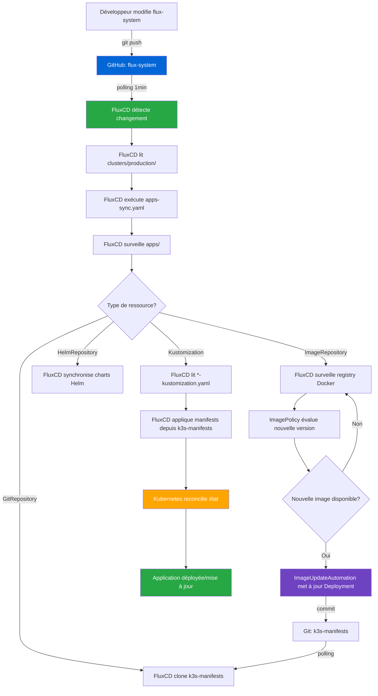

# Documentation du dépôt `flux-system`


## Vue d'ensemble

Ce dépôt contient la configuration **GitOps de FluxCD** pour l'infrastructure **LoutikCLOUD**. Il orchestre le déploiement continu de toutes les applications et composants d'infrastructure en suivant le pattern "App of Apps". FluxCD surveille ce dépôt en permanence et applique automatiquement les changements détectés sur le cluster Kubernetes.

---

## Arborescence du dépôt

```text
loutik-cloud_k3s-flux-system/
├── readme.md
├── apps/
│   └── ...
├── clusters/
│   └── production/
│       ├── apps-sync.yaml
│       ├── infrastructure-sync.yaml
│       └── flux-system/
│           └── ...
└── infrastructure/
    └── traefik-kustomization.yaml
```

### Description des dossiers

**`clusters/production/`**  
Point d'entrée principal du cluster Kubernetes de production. FluxCD surveille nativement ce dossier lors de son initialisation. Il contient les fichiers de synchronisation principaux (`apps-sync.yaml` et `infrastructure-sync.yaml`) qui orchestrent le déploiement de l'ensemble de l'infrastructure selon le pattern "App of Apps".

**`clusters/production/flux-system/`**  
⚠️ **Dossier système géré automatiquement par FluxCD** - Ne jamais modifier manuellement. Contient les composants internes de FluxCD (controllers, CRDs, RBAC) et la configuration de synchronisation Git. Mis à jour automatiquement lors des opérations de bootstrap ou upgrade de FluxCD.

**`apps/`**  
Centralise toutes les déclarations de déploiement des **applications métiers**. Contient quatre types de ressources FluxCD :
- **`k3s-manifests-source.yaml`** : Source GitRepository pointant vers le dépôt des manifestes
- **`*-kustomization.yaml`** : Lie une application du dépôt `k3s-manifests` à FluxCD
- **`*-imagerepo.yaml` / `*-imagepolicy.yaml` / `*-imageupdate.yaml`** : Automatisation des mises à jour d'images Docker
- **`*-helmrepo.yaml`** : Référence vers des repositories Helm externes

**`infrastructure/`**  
Regroupe les déclarations de déploiement des **composants transverses** du cluster (Traefik, monitoring, cert-manager, etc.). Structure identique au dossier `apps/` avec des fichiers `*-kustomization.yaml`.

## Ajouter une nouvelle application

> **Prérequis** : L'application doit avoir ses manifestes présents dans le dépôt `loutik-cloud_k3s-manifests/apps/<nom-service>/`

### 1️⃣ Créer la Kustomization FluxCD avec la CLI

```bash
# Se positionner dans le dépôt flux-system
cd loutik-cloud_k3s-flux-system/apps

# Créer la Kustomization
flux create kustomization <nom-service> \
  --source=GitRepository/k3s-manifests \
  --path="./apps/<nom-service>" \
  --prune=true \
  --wait=true \
  --interval=10m \
  --retry-interval=1m \
  --timeout=5m \
  --export > <nom-service>-kustomization.yaml
```

**Explications des paramètres :**
- `--source` : Référence vers la source Git `k3s-manifests` (définie dans `k3s-manifests-source.yaml`)
- `--path` : Chemin vers le dossier de l'application dans le dépôt
- `--prune=true` : Supprime automatiquement les ressources obsolètes
- `--wait=true` : Attend que toutes les ressources soient prêtes
- `--interval` : Fréquence de vérification des changements Git
- `--retry-interval` : Délai entre les tentatives en cas d'échec
- `--timeout` : Timeout maximum pour le déploiement
- `--export` : Génère le fichier YAML au lieu de l'appliquer directement

**Fichier généré (`<nom-service>-kustomization.yaml`)** :
```yaml
apiVersion: kustomize.toolkit.fluxcd.io/v1
kind: Kustomization
metadata:
  name: <nom-service>
  namespace: flux-system
spec:
  interval: 10m
  path: ./apps/<nom-service>
  prune: true
  retryInterval: 1m
  sourceRef:
    kind: GitRepository
    name: k3s-manifests
  timeout: 5m
  wait: true
```

### 2️⃣ (Optionnel) Configurer l'automatisation des images

Si vous souhaitez que FluxCD mette automatiquement à jour les images Docker de l'application :

**a) Créer l'ImageRepository** :
```bash
flux create image repository <nom-service> \
  --image=ghcr.io/<organisation>/<image> \
  --interval=5m \
  --export > <nom-service>-imagerepo.yaml
```

**Fichier généré (`<nom-service>-imagerepo.yaml`)** :
```yaml
apiVersion: image.toolkit.fluxcd.io/v1beta2
kind: ImageRepository
metadata:
  name: <nom-service>
  namespace: flux-system
spec:
  image: ghcr.io/<organisation>/<image>
  interval: 5m
```

**b) Créer l'ImagePolicy** :
```bash
flux create image policy <nom-service> \
  --image-ref=<nom-service> \
  --select-semver=">=1.0.0" \
  --export > <nom-service>-imagepolicy.yaml
```

**Fichier généré (`<nom-service>-imagepolicy.yaml`)** :
```yaml
apiVersion: image.toolkit.fluxcd.io/v1beta2
kind: ImagePolicy
metadata:
  name: <nom-service>
  namespace: flux-system
spec:
  imageRepositoryRef:
    name: <nom-service>
  policy:
    semver:
      range: '>=1.0.0'
```

**Stratégies de sélection disponibles :**
- `--select-semver=">=1.0.0"` : Versions sémantiques (recommandé)
- `--select-semver="1.x"` : Versions mineures uniquement
- `--select-numeric=asc` : Ordre numérique ascendant
- `--select-alphabetic=asc` : Ordre alphabétique ascendant

**c) Créer l'ImageUpdateAutomation** :
```bash
flux create image update <nom-service> \
  --interval=5m \
  --git-repo-ref=k3s-manifests \
  --git-repo-path="./apps/<nom-service>" \
  --checkout-branch=main \
  --push-branch=main \
  --author-name=fluxcdbot \
  --author-email=flux@loutik.cloud \
  --commit-template="{{range .Updated.Images}}{{println .}}{{end}}" \
  --export > <nom-service>-imageupdate.yaml
```

**Fichier généré (`<nom-service>-imageupdate.yaml`)** :
```yaml
apiVersion: image.toolkit.fluxcd.io/v1beta1
kind: ImageUpdateAutomation
metadata:
  name: <nom-service>
  namespace: flux-system
spec:
  interval: 5m
  sourceRef:
    kind: GitRepository
    name: k3s-manifests
  git:
    checkout:
      ref:
        branch: main
    commit:
      author:
        email: flux@loutik.cloud
        name: fluxcdbot
      messageTemplate: '{{range .Updated.Images}}{{println .}}{{end}}'
    push:
      branch: main
  update:
    path: ./apps/<nom-service>
    strategy: Setters
```

**d) Annoter le Deployment dans k3s-manifests** :

Dans le fichier `loutik-cloud_k3s-manifests/apps/<nom-service>/deployment.yaml`, ajouter l'annotation :

```yaml
apiVersion: apps/v1
kind: Deployment
metadata:
  name: <nom-service>
  namespace: <nom-service>
spec:
  template:
    spec:
      containers:
      - name: <nom-service>
        image: ghcr.io/<organisation>/<image>:1.0.0 # {"$imagepolicy": "flux-system:<nom-service>"}
```

### 3️⃣ (Optionnel) Ajouter un HelmRepository

Pour déployer une application via Helm Chart externe :

```bash
flux create source helm <nom-repo> \
  --url=https://charts.example.com \
  --interval=10m \
  --export > <nom-service>-helmrepo.yaml
```

**Fichier généré (`<nom-service>-helmrepo.yaml`)** :
```yaml
apiVersion: source.toolkit.fluxcd.io/v1beta2
kind: HelmRepository
metadata:
  name: <nom-repo>
  namespace: flux-system
spec:
  interval: 10m
  url: https://charts.example.com
```

Puis dans `k3s-manifests`, créer un HelmRelease référençant ce repository.

### 4️⃣ Commit et déploiement

```bash
# Ajouter les fichiers créés
git add apps/<nom-service>-*.yaml

# Commit avec message sémantique
git commit -m "feat: add <nom-service> flux configuration"

# Push vers le dépôt
git push
```

FluxCD détectera automatiquement les changements via `apps-sync.yaml` et déploiera l'application dans les **minutes suivantes**.

### 5️⃣ Vérifier le déploiement

```bash
# Surveiller la réconciliation
flux get kustomizations -w

# Vérifier la Kustomization spécifique
flux get kustomization <nom-service>

# Vérifier l'Image Automation (si configurée)
flux get image repository <nom-service>
flux get image policy <nom-service>
flux get image update <nom-service>

# Voir les événements FluxCD
flux events --for Kustomization/<nom-service>
```

## Rappel des bonnes pratiques

### 📂 Organisation des fichiers
- ✅ **Utiliser la CLI `flux create`** pour générer les fichiers (garantit la syntaxe correcte)
- ✅ **Nommage cohérent** : `<nom-service>-<type>.yaml` (ex: `site-docs-kustomization.yaml`)
- ✅ **Un fichier par ressource** pour faciliter la lisibilité
- ✅ **Grouper les fichiers** d'une même application (kustomization + imagerepo + imagepolicy + imageupdate)

### 🔄 Kustomization
- ✅ **Toujours activer `prune: true`** pour nettoyer les ressources obsolètes
- ✅ **Activer `wait: true`** pour valider la santé avant de continuer
- ✅ **Définir un `timeout` raisonnable** (5m par défaut)
- ✅ **Utiliser `healthChecks`** pour vérifier les Deployments critiques
- ✅ **Configurer `dependsOn`** si une app dépend d'une autre

### 🖼️ Image Automation
- ✅ **Privilégier les tags sémantiques** (semver) plutôt que `latest`
- ✅ **Définir une range restrictive** (ex: `1.x` pour éviter les breaking changes)
- ✅ **Tester en staging** avant d'activer l'automation en production
- ✅ **Committer les annotations** dans k3s-manifests pour activer l'automation
- ✅ **Surveiller les logs** de l'image-automation-controller

### 🔐 Sécurité
- ✅ **Ne jamais commiter de tokens** ou secrets dans ce dépôt
- ✅ **Utiliser des secrets Kubernetes** pour les credentials Git/Registry
- ✅ **Limiter les permissions** du ServiceAccount FluxCD
- ✅ **Activer la signature GPG** des commits (optionnel mais recommandé)

### 🎯 Pattern App of Apps
- ✅ **Ne jamais modifier `flux-system/`** manuellement
- ✅ **Séparer apps et infrastructure** (dossiers dédiés)
- ✅ **Utiliser `apps-sync.yaml`** comme point d'entrée unique
- ✅ **Documenter les dépendances** entre applications

## Debug

### Vérifier l'état de FluxCD

```bash
# Vue d'ensemble de toutes les ressources FluxCD
flux get all

# Vérifier les Kustomizations
flux get kustomizations

# Vérifier les sources Git
flux get sources git

# Vérifier les HelmRepositories
flux get sources helm

# Vérifier l'Image Automation
flux get images all

# Logs des controllers FluxCD
flux logs --level=error --all-namespaces
```

### Forcer la réconciliation

```bash
# Forcer la réconciliation d'une source Git
flux reconcile source git flux-system
flux reconcile source git k3s-manifests

# Forcer la réconciliation d'une Kustomization
flux reconcile kustomization <nom-service> --with-source

# Forcer la réconciliation de l'App of Apps
flux reconcile kustomization apps-sync --with-source
flux reconcile kustomization infrastructure-sync --with-source

# Forcer la vérification d'une image
flux reconcile image repository <nom-service>
```

### Debug d'une application spécifique

```bash
# Vérifier le statut de la Kustomization
flux get kustomization <nom-service>

# Voir les détails et les erreurs
kubectl describe kustomization <nom-service> -n flux-system

# Voir les événements FluxCD
flux events --for Kustomization/<nom-service>

# Logs du kustomize-controller
flux logs --kind=Kustomization --name=<nom-service>
```

### Debug Image Automation

```bash
# Vérifier le statut des images
flux get images all

# Voir quelle version est détectée
flux get image policy <nom-service>

# Vérifier les événements d'update
flux events --for ImageUpdateAutomation/<nom-service>

# Logs de l'image-automation-controller
kubectl logs -n flux-system deploy/image-automation-controller
```

### Suspendre/Reprendre un déploiement

```bash
# Suspendre une Kustomization (empêche FluxCD de réconcilier)
flux suspend kustomization <nom-service>

# Reprendre une Kustomization
flux resume kustomization <nom-service>

# Suspendre toutes les Kustomizations
flux suspend kustomization --all

# Suspendre l'Image Automation
flux suspend image update <nom-service>
```

### Vérifier la santé du cluster FluxCD

```bash
# Check complet de FluxCD
flux check

# Vérifier les CRDs installés
kubectl get crds | grep fluxcd

# Vérifier les controllers
kubectl get pods -n flux-system
```

### Debug des erreurs courantes

**Erreur : "Source not found"**
```bash
# Vérifier que la source existe
flux get sources git

# Recréer la source si nécessaire
flux reconcile source git k3s-manifests
```

**Erreur : "Health check failed"**
```bash
# Vérifier les pods de l'application
kubectl get pods -n <nom-service>

# Vérifier les événements
kubectl get events -n <nom-service> --sort-by='.lastTimestamp'
```

**Erreur : "ImagePolicy not found"**
```bash
# Vérifier que l'ImagePolicy existe
flux get image policy <nom-service>

# Vérifier l'annotation dans le Deployment
kubectl get deployment <nom-service> -n <nom-service> -o yaml | grep imagepolicy
```

---

## Workflow



## Liens utiles

- [Documentation FluxCD](https://fluxcd.io/docs/)
- [FluxCD CLI Reference](https://fluxcd.io/flux/cmd/)
- [Image Automation Guide](https://fluxcd.io/flux/guides/image-update/)
- [Kustomize Documentation](https://kustomize.io/)
- Dépôt des manifestes : [loutik-cloud_k3s-manifests](https://github.com/FireToak/loutik-cloud_k3s-manifests)

---

**Maintenu par l'équipe DevOps LoutikCLOUD 🦥**

*Dernière mise à jour : 18 février 2026*