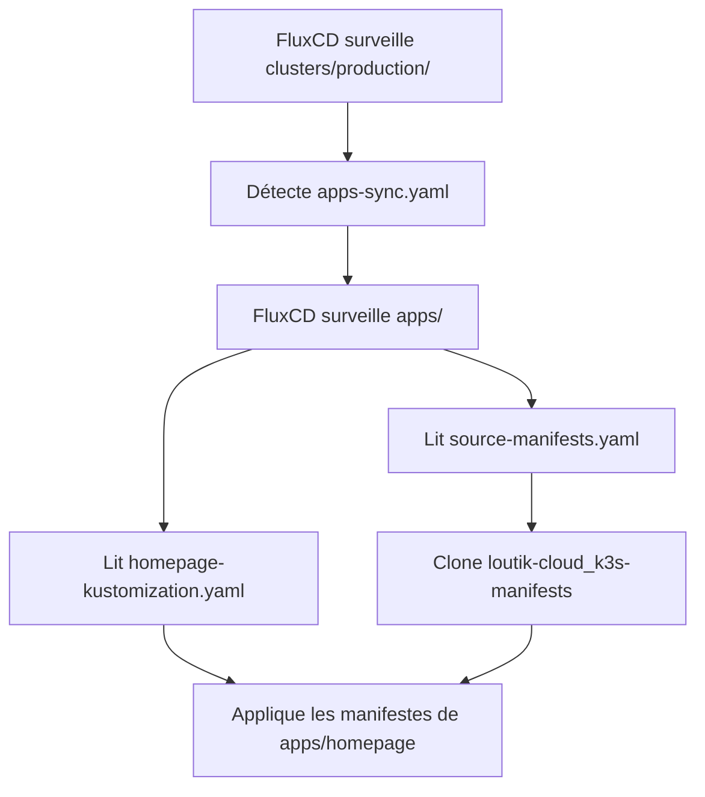

# Documentation du dépôt `flux-system`


## Vue d'ensemble

Ce dépôt contient la configuration GitOps de **FluxCD** pour l'infrastructure **LoutikCLOUD**. Il orchestre le déploiement continu des applications Kubernetes en suivant le pattern "App of Apps".

## Architecture du dépôt

```text
loutik-cloud_k3s-flux-system/
├── apps/
│   ├── <nom-du-service>-kustomization.yaml
│   └── source-manifests.yaml
└── clusters/
    └── production/
        ├── apps-sync.yaml
        └── flux-system/
```

## Structure détaillée

### 📁 `clusters/production/`

Dossier racine représentant l'environnement de production du cluster Kubernetes. C'est le point d'entrée surveillé nativement par FluxCD lors de son initialisation.

**Contenu clé :**
- Point de réconciliation principal de FluxCD
- Configuration spécifique à l'environnement production

---
### 📁 `clusters/production/flux-system/`

Dossier système généré et maintenu automatiquement par FluxCD.

**Caractéristiques :**
- ⚠️ **Ne pas modifier manuellement** : géré par FluxCD
- Contient les composants internes de FluxCD (controllers, CRDs, RBAC)
- Mis à jour automatiquement lors des opérations de bootstrap ou upgrade

---
### 📄 `clusters/production/apps-sync.yaml`

**Fichier principal "App of Apps"** qui implémente le pattern de déploiement centralisé.

**Rôle :**
- Ordonne à FluxCD de surveiller en continu le dossier `apps/`
- Déclenche automatiquement la réconciliation lors de modifications dans `apps/`
- Point d'entrée unique pour tous les déploiements d'applications

**Type de ressource :** `Kustomization` (FluxCD)

---
### 📁 `apps/`

Dossier centralisant toutes les déclarations de déploiement des services LoutikCLOUD.

**Organisation :**
- Un fichier `*-kustomization.yaml` par service
- Un fichier `source-manifests.yaml` définissant la source des manifestes

---
### 📄 `apps/source-manifests.yaml`

Définit la **source GitRepository** pointant vers le dépôt contenant les manifestes Kubernetes.

**Fonction :**
- Indique à FluxCD l'URL du dépôt `loutik-cloud_k3s-manifests`
- Configure la branche, l'intervalle de synchronisation et les credentials si nécessaire
- Permet à FluxCD de cloner et surveiller le dépôt de manifestes

**Type de ressource :** `GitRepository` (FluxCD)

**Exemple de contenu :**
```yaml
apiVersion: source.toolkit.fluxcd.io/v1
kind: GitRepository
metadata:
  name: manifests
  namespace: flux-system
spec:
  interval: 1m
  url: https://github.com/loutik-cloud/k3s-manifests
  ref:
    branch: main
```

---
### 📄 `apps/<nom-du-service>-kustomization.yaml`

Fichier de liaison entre la source Git et le déploiement d'une application spécifique.

**Fonction :**
- Relie la `GitRepository` (source-manifests) au dossier de l'application
- Spécifie le chemin vers les manifestes Kubernetes du service
- Configure les paramètres de déploiement (prune, healthcheck, dependencies)

**Type de ressource :** `Kustomization` (FluxCD)

**Exemple pour Homepage :**
```yaml
apiVersion: kustomize.toolkit.fluxcd.io/v1
kind: Kustomization
metadata:
  name: homepage
  namespace: flux-system
spec:
  interval: 10m
  sourceRef:
    kind: GitRepository
    name: manifests
  path: ./apps/homepage
  prune: true
  wait: true
```

---
## Flux de déploiement



1. **FluxCD démarre** et surveille `clusters/production/`
2. **Découvre `apps-sync.yaml`** qui pointe vers `apps/`
3. **Lit `source-manifests.yaml`** et clone le dépôt de manifestes
4. **Traite chaque `*-kustomization.yaml`** dans `apps/`
5. **Applique les manifestes** correspondants sur le cluster

---
## Ajouter une nouvelle application

Pour déployer un nouveau service :

1. **Ajouter les manifestes Kubernetes** dans `loutik-cloud_k3s-manifests/apps/<nom-service>/`

2. **Créer `apps/<nom-service>-kustomization.yaml`** dans ce dépôt :
```yaml
apiVersion: kustomize.toolkit.fluxcd.io/v1
kind: Kustomization
metadata:
  name: <nom-service>
  namespace: flux-system
spec:
  interval: 10m
  sourceRef:
    kind: GitRepository
    name: manifests
  path: ./apps/<nom-service>
  prune: true
  wait: true
```

3. **Commit et push** : FluxCD détectera automatiquement le nouveau fichier

---
## Bonnes pratiques

- ✅ **Ne jamais modifier `flux-system/`** manuellement
- ✅ **Un fichier Kustomization par service** dans `apps/`
- ✅ **Utiliser des noms explicites** pour les fichiers (`<service>-kustomization.yaml`)
- ✅ **Activer `prune: true`** pour supprimer les ressources obsolètes
- ✅ **Configurer `wait: true`** pour valider le healthcheck avant de continuer
- ✅ **Définir des `dependsOn`** si un service dépend d'un autre

---
## Commandes utiles

```bash
# Vérifier l'état de FluxCD
flux get all

# Forcer la réconciliation
flux reconcile kustomization apps-sync --with-source

# Voir les logs FluxCD
flux logs --level=error --all-namespaces

# Suspendre/reprendre un déploiement
flux suspend kustomization <nom-service>
flux resume kustomization <nom-service>
```

---
## Dépannage

### FluxCD ne détecte pas les changements
```bash
flux reconcile source git manifests
flux reconcile kustomization apps-sync
```

### Une application ne se déploie pas
```bash
flux get kustomizations
kubectl describe kustomization <nom-service> -n flux-system
```

### Vérifier les sources Git
```bash
flux get sources git
```

---
## Liens utiles

- [Documentation FluxCD](https://fluxcd.io/docs/)
- [Pattern App of Apps](https://fluxcd.io/flux/guides/repository-structure/)
- Dépôt des manifestes : [loutik-cloud_k3s-manifests](https://github.com/FireToak/loutik-cloud_k3s-manifests)

---

**Maintenu par l'équipe DevOps LoutikCLOUD 🦥**

*Dernière mise à jour : 16 février 2026*